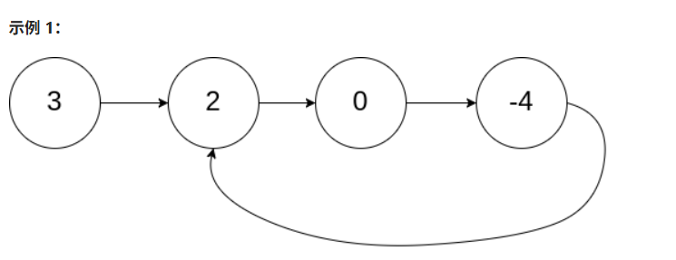
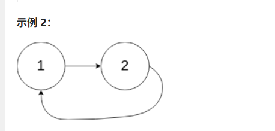
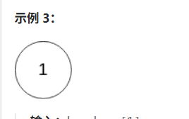

# 💰💰💰

给定一个链表的头节点 head ，返回链表开始入环的第一个节点。 如果链表无环，则返回 null。

如果链表中有某个节点，可以通过连续跟踪 next 指针再次到达，则链表中存在环。 为了表示给定链表中的环，评测系统内部使用整数 pos 来表示链表尾连接到链表中的位置（索引从 0 开始）。如果 pos 是 -1，则在该链表中没有环。注意：pos 不作为参数进行传递，仅仅是为了标识链表的实际情况。

不允许修改 链表。

> ### 示例 1：



输入：head = [3,2,0,-4], pos = 1
输出：返回索引为 1 的链表节点
解释：链表中有一个环，其尾部连接到第二个节点。

> ### 示例 2：
>
> 

输入：head = [1,2], pos = 0
输出：返回索引为 0 的链表节点
解释：链表中有一个环，其尾部连接到第一个节点。

> ### 示例 3：



输入：head = [1], pos = -1
输出：返回 null
解释：链表中没有环。

# 💯💯💯

```js
var detectCycle = function (head) {
  // 1. 边界处理：空链表或只有一个节点，肯定无环
  if (!head || !head.next) return null;

  // 2. 初始化快慢指针，都从头节点开始
  let slow = head;
  let fast = head;

  // 3. 第一阶段：快慢指针找环内第一次相遇点
  while (fast && fast.next) {
    slow = slow.next; // 慢指针走 1 步
    fast = fast.next.next; // 快指针走 2 步

    // 相遇了！说明有环
    if (slow === fast) {
      // 4. 第二阶段：找入环点
      let p1 = head; // 从头开始的指针
      let p2 = slow; // 从相遇点开始的指针（这里用 slow 也行）

      // 两个指针都每次走 1 步，再次相遇的节点就是入环第一个节点
      while (p1 !== p2) {
        p1 = p1.next;
        p2 = p2.next;
      }

      return p1; // 或者 return p2，都一样
    }
  }

  // 5. 如果 fast 走到 null，说明没环
  return null;
};
```

### 图解过程（推荐你手画一下）

```
示例链表：3 → 4 → 5 → 6 → 7 → 8
                   ↑              ↓
                   10 ← 9 ← 2 ←──────┘
入环点是节点 2（pos = 3）
```

| 步骤    | slow 位置 | fast 位置 | 是否相遇             |
| ------- | --------- | --------- | -------------------- |
| 初始    | 3         | 3         |                      |
| 第 1 轮 | 4         | 5         |                      |
| 第 2 轮 | 5         | 9         |                      |
| 第 3 轮 | 6         | 2         |                      |
| 第 4 轮 | 7         | 6         |                      |
| 第 5 轮 | 8         | 9         |                      |
| 第 6 轮 | 10        | 2         |                      |
| 第 7 轮 | 2         | 6         |                      |
| 第 8 轮 | 6         | 10        |                      |
| 第 9 轮 | 9         | 6         | 相遇！（都在节点 6） |

相遇后：

- 把 p1 放回头节点（3）
- p2 留在相遇点（6）
- 两者一起一步步走：

```
p1: 3 → 4 → 5 → 6 → 7 → 8 → 10 → 2
p2: 6 → 7 → 8 → 10 → 2 → ...
          ↑_______________↑
                 在节点 2 相遇 → 入环点！
```

### 为什么第二次相遇就是入环点？（一句话记住）

> **从头到入环点的距离 = 从第一次相遇点沿着环再走到入环点的距离**  
> 所以让一个指针从头走，另一个从相遇点走，步速相同，必然在入环点相遇。

### 常见面试易错点提醒

| 场景                              | 正确处理方式                             |
| --------------------------------- | ---------------------------------------- |
| 只有两个节点成环（如 1→2→1）      | 代码能正确返回节点 1                     |
| 整个链表都是环（head 自己指自己） | 代码能正确返回 head                      |
| 链表无环                          | 快指针会走到 null，while 结束，返回 null |
| head 为 null                      | 提前返回 null                            |

### 总结：这 20 行代码就是面试最优解

- 时间复杂度：O(n)
- 空间复杂度：O(1)
- 不修改原链表
- 逻辑清晰，数学严谨

背下来这段 JS 代码，面试遇到链表环问题直接写就行，面试官看了都会说“好”！

需要我再给你画一张完整的动图思路或者出几道变种题吗？
