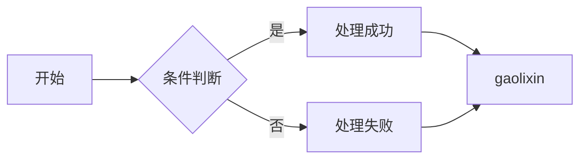
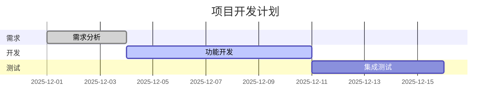
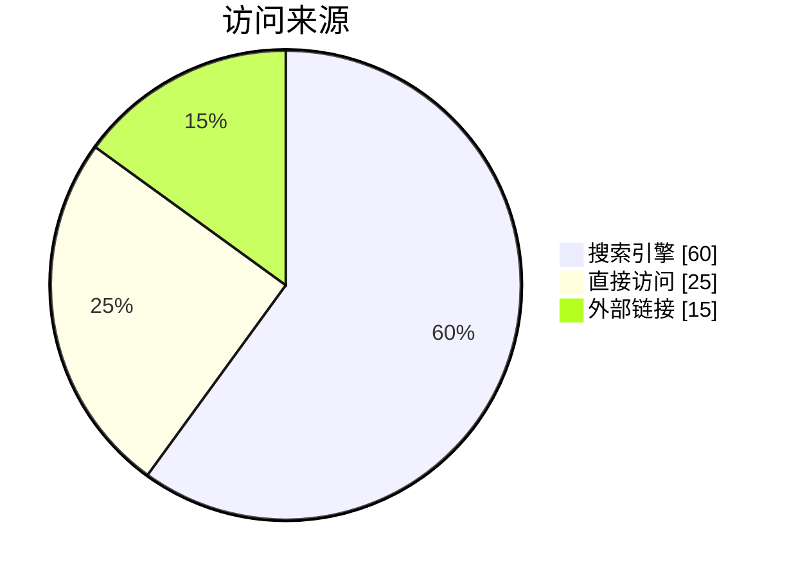
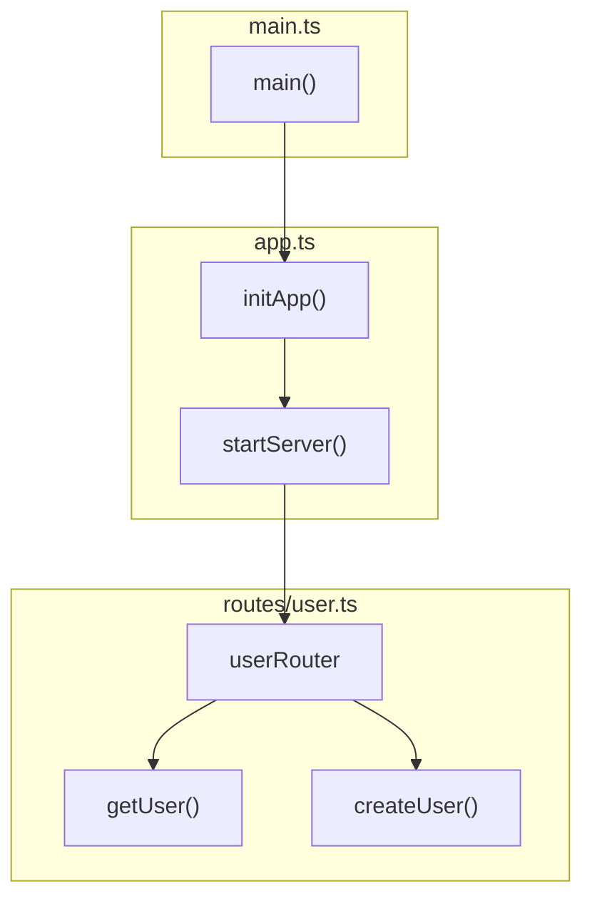
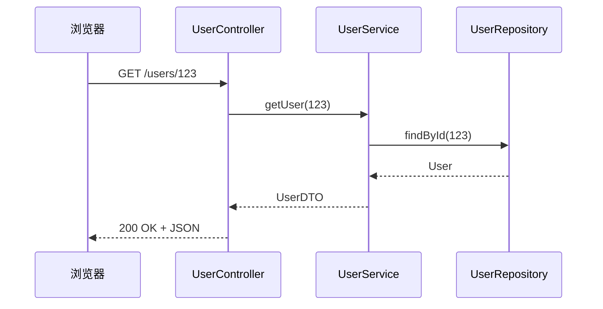
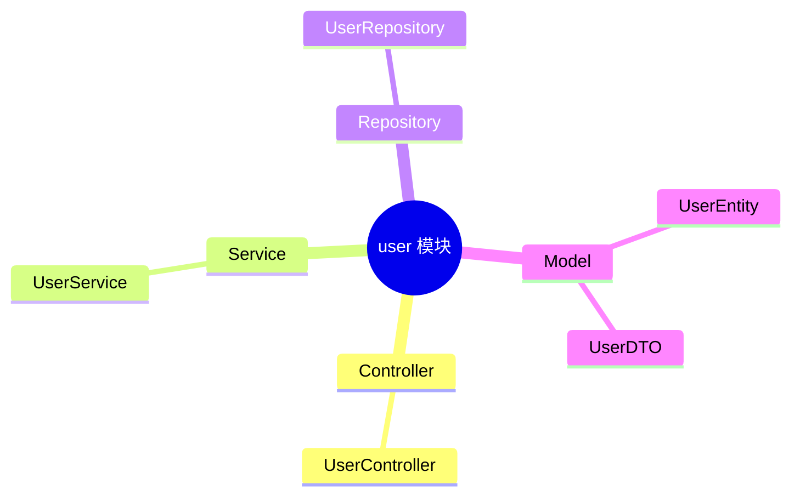
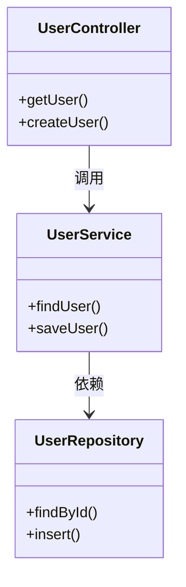

# Mermaid 流程图示例

这是一个简单的 Mermaid 流程图：

# Mermaid 示例





# 代码结构 & 调用关系


# 请求处理流程（调用链）



读文档的人就可以：

- 先“看代码片段”（了解实现）
- 再“看图”（理解这一段代码在整个系统中的位置）

---

## 5️⃣ 常见问题 & 建议

1. **能不能自动从代码里生成这种图？**  
   - Rspress + `rspress-plugin-mermaid` 本身是**纯文档层的**，不会自动分析代码。  
   - 一般做法是：你手动维护 Mermaid 图（好处是灵活、可读性强）。

2. **关系很多时图很乱怎么办？**  
   - 分模块画多张图：比如“Controller 调用图”“Service 层依赖图”“DB 访问图”分开写。
   - 给节点起简短一点的名字，例如 `UserCtrl / UserSvc / UserRepo`。

3. **想表达“强依赖 / 弱依赖 / 可选”**  
   - 你可以通过不同箭头风格或标签来区分，比如：

     ```mermaid
     graph LR
       A --> B
       A -.-> C
       A --optional--> D
     ```

---

如果你愿意，可以：

- 把你现在的**代码结构**（比如文件名 + 几个主要函数）发给我，
- 我可以直接帮你“翻译成一两张 Mermaid 图”，你复制进 Rspress 就能用。
::contentReference[oaicite:0]{index=0}

# 模块结构思维导图


# 类之间的依赖关系


# 代码结构 & 调用关系


# 代码结构 & 调用关系（自定义样式）

```mermaid
flowchart TD
  %% --- 节点定义 ---
  subgraph "main.ts"
    mainEntry["main()"]
  end

  subgraph "app.ts"
    init["initApp()"]
    start["startServer()"]
  end

  subgraph "routes/user.ts"
    userRouter["userRouter"]
    getUser["getUser()"]
    createUser["createUser()"]
  end

  %% --- 边（箭头） ---
  mainEntry -->|调用| init
  init --> start
  start --> userRouter
  userRouter --> getUser
  userRouter --> createUser

  %% === 样式部分（关键） ===

  %% 1. 设置 mainEntry --> init 的箭头改为红色
  linkStyle 0 stroke:#ff0000,stroke-width:2px,color:#ff0000;

  %% 2. 设置所有节点背景为灰色、文字为黑色
  classDef gray fill:#e0e0e0,stroke:#666,color:#000;
  class mainEntry,init,start,userRouter,getUser,createUser gray;
```
